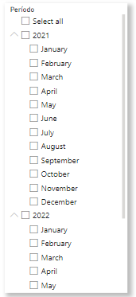
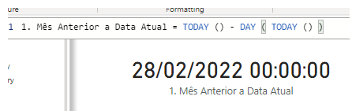
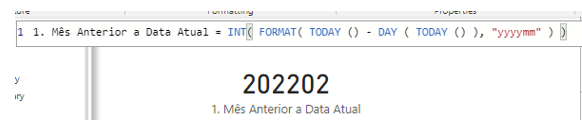
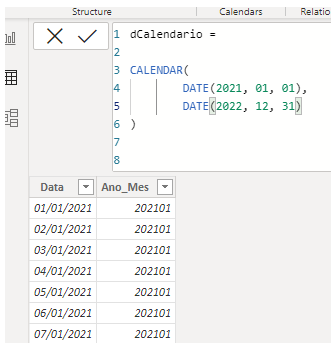
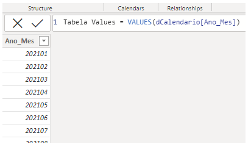
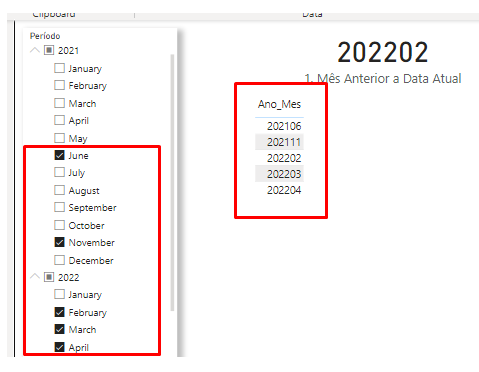
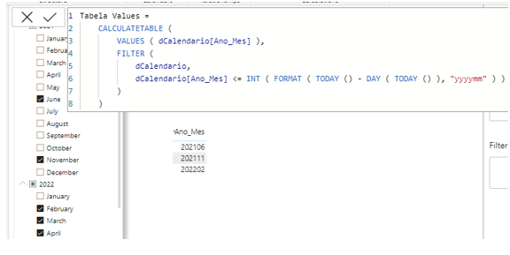
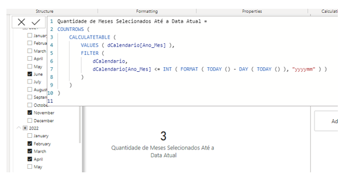

# Desafio Power BI - Quantidade de Meses Selecionados até a Data Atual

## Introdução ao desafio

Embora esteja focando os meus estudos em engenharia de dados, no dia a dia acabo realizando algumas atividades com Dax via Power BI Desktop e Analysis Services (responsável pela camada semântica e centralização das informações de modo a ser um ambiente de Self Service BI garantindo maior confiabilidade, disponibilidade, integridade dos dados, sendo o repositório oficial de consumo de informações consideradas estratégicas). 

O objetivo desse tutorial é basicamente realizar a contagem dos meses selecionados nesse filtro (segmentador de dados) respeitando a data atual. 

  

Desse modo, por critério, considerando a data atual (24/03/2022, é a data em que escrevo este tutorial) o correto é contar os meses selecionados até Fevereiro de 2022 visto que o mês de Março de 2022 ainda não está encerrado. Nos próximos passos irei retratar o racional aplicado até conseguir chegar no resultado desejado. 

## Descobrindo mês anterior ao mês atual
O primeiro passo foi descobrir qual é o mês atual e por consequência qual o mês anterior a ele. Para isso, a seguinte medida foi utilizada: 

  

Basicamente, a medida acima verifica a data de hoje através da função TODAY() e realizada a subtração da data de hoje pelo número do dia de hoje. Neste caso, o racional é o seguinte: 

24/03/2022 - 24 = 28/02/2022
Em seguida, foi realizada a conversão da data para o formato Ano e Mês. 

  

Desse modo a data 28/02/2022 se tornou 202202, sendo respectivamente o ano e mês. Agora, com essa lógica em mente, vamos virar a chave para visualizar a tabela dCalendario: 

  

## Estrutura da tabela calendário e utilização de funções tabulares
Basicamente é uma tabela simples que vai de 01/01/2021 até 31/12/2022 e possui apenas duas colunas sendo elas a Data e a coluna de Ano_Mes, assim como no exemplo anterior utilizando a função FORMAT juntamente com a máscara “yyyymm”. 

Dito posto, é chegado é o momento de capturar os meses e anos selecionados no filtro. Para isso, não irei entrar ao mérito de contextos, funções de tabelas e relacionamentos em um nível mais avançado visto que o objetivo é exemplificar o racional utilizado: 

  

Com a função VALUES é possível verificar os valores únicos dentro de uma seleção. Neste caso foi criada apenas uma tabela em dax para exemplificar os valores. 

  

Desse modo, pode-se observar que o meses Junho-2021, Novembro-2021, Fevereiro-2021, Março-2021 e Abril-2021 foram selecionados, e já estão visíveis no visual. Agora o próximo passo é limitá-los de acordo com a Data Atual conforme foi exemplificada anteriormente. 

A solução para isso foi unir as duas lógicas aplicadas até agora em momentos diferentes: 

  

Basicamente, temos a função VALUES que retorna os valores de maneira distinta em um conjunto de dados. Com as funções CALCULATETABLE e FILTER, podemos aplicar filtros em uma tabela seja ela física ou virtual, e no caso da função VALUES, como seus retornos são em formato de tabela, tudo se encaixou perfeitamente. 

## Finalizando a solução
Por fim, para finalizar é necessário realizar uma contagem dos valores, para isso, basta utilizar a função COUNTROWS, capaz de realizar a contagem de todas as linhas de uma tabela, e, mais uma vez, como o CALCULATETABLE também retorna uma tabela, é perfeitamente possível utilizar a COUNTOROWS para realizar uma contagem e transformar toda essa lógica em uma medida DAX. 

  

Espero que tenham gostado da resolução deste desafio.  

## Links da documentação oficial das funções utilizadas

- <a href="https://docs.microsoft.com/en-us/dax/today-function-dax"> TODAY() </a>
- <a href="https://docs.microsoft.com/en-us/dax/day-function-dax"> DAY() </a>
- <a href="https://docs.microsoft.com/EN-US/dax/format-function-dax"> FORMAT()</a>
- <a href="https://docs.microsoft.com/en-us/dax/int-function-dax"> INT()</a>
- <a href="https://docs.microsoft.com/en-us/dax/values-function-dax"> VALUES()</a>
- <a href="https://docs.microsoft.com/en-us/dax/calculatetable-function-dax"> CALCULATETABLE()</a>
- <a href="https://docs.microsoft.com/en-us/dax/filter-function-dax"> FILTER() </a>
- <a href="https://docs.microsoft.com/en-us/dax/countrows-function-dax"> COUNTROWS() </a> 

